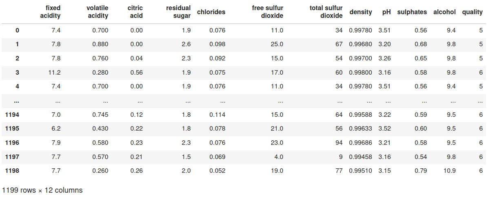
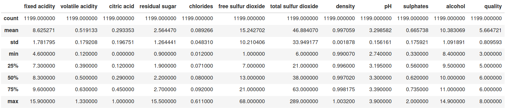
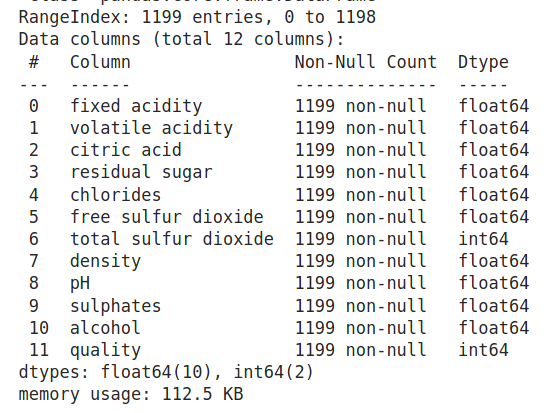
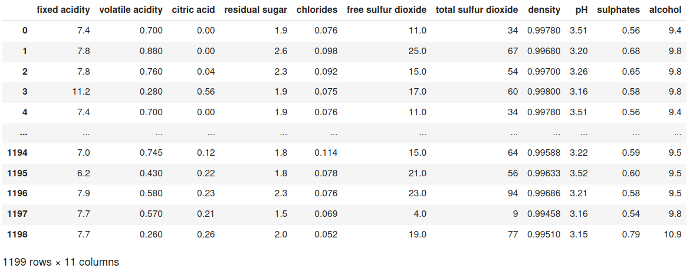
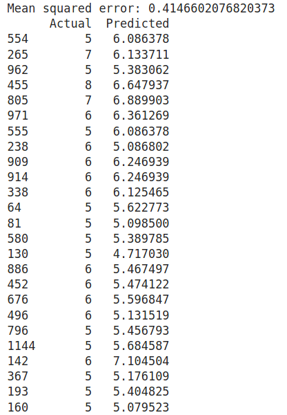
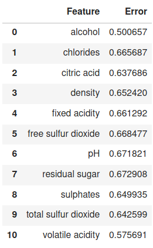
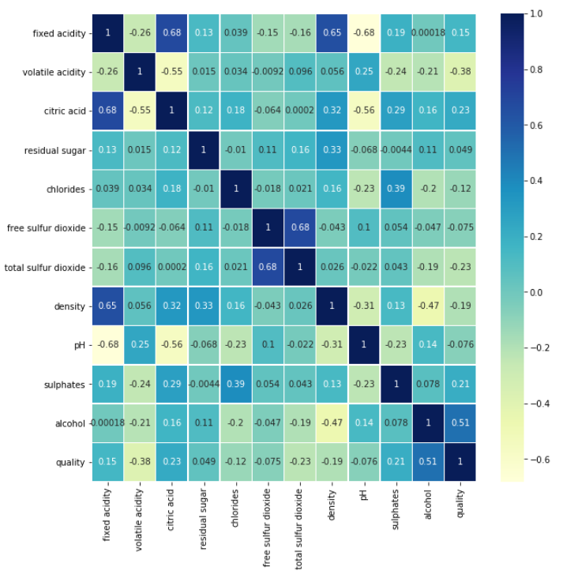
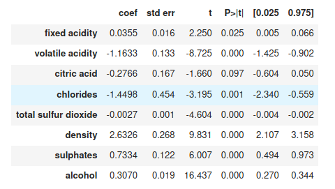
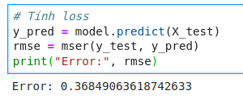

# Lab04:  Linear regression 

Courses `MTH00051`: Toán ứng dụng và thống kê
`18CLC6`, `FIT - HCMUS`.
`04/09/2020`

Đây là đồ án cá nhân, do một thành viên thực hiện:

-   `18127231`: Đoàn Đình Toàn (GitHub: [@t3bol90](https://github.com/t3bol90))
---

## Về đồ án này:

Đề bài ở::
https://courses.ctda.hcmus.edu.vn/mod/resource/view.php?id=22047

### Giới thiệu:

File **"wine.csv"** là cơ sở dữ liệu đánh giá chất lượng của 1200 chai rượu vang theo thang điểm 1 - 10 dựa trên 11 tính chất khác nhau. (File đính kèm trong file zip).

### Yêu cầu:

1. Xây dựng mô hình đánh giá chất lượng rượu sử dụng phương pháp hồi quy tuyến tính.

    ```latex
    a. Sử dụng toàn bộ 11 đặc trưng đề bài cung cấp.
    
    b. Sử dụng duy nhất 1 đặc trưng cho kết quả tốt nhất. (Gợi ý: Phương pháp Cross Validation)
    
    c. Xây dựng một mô hình của riêng bạn cho kết quả tốt nhất.
    ```

### Môi trường thực hiện

`Python 3.7` với `Jupyter notebook` và chạy hoàn toàn ở `local`.

## Mức độ hoàn thành:

| Yêu cầu | Mức độ hoàn thành    |
| ------- | ---- |
| Xây dựng mô hình hồi qui tuyến tính với 11 đặc trưng (features) | 100% |
| Xây dựng mô hình hồi qui tuyến tính với 1 đặc trưng và chỉ ra feature có kết quả tốt nhất (sử dụng phương pháp Cross Validation) | 100% |
| Xây dựng mô hình riêng, sử dụng nhiều phương pháp và đạt kết quả tốt nhất | 100% |


## Ý tưởng thực hiện & mô tả:
Sau khi đọc file đầu vào, ta có thể thấy như sau:

Các features lần lượt là:fixed acidity, volatile acidity, citric acid, residual sugar, chlorides, free sulfur dioxide, total sulfur dioxide, density, pH, sulphates, alcohol (11 features). Output mà ta cần predict là quality - có giá trị trong khoảng 0-10 (nhưng trong data có giá trị từ 3.0 tới 8.0).

|  |
| :----------------------------------------------------------: |
| **Input data có 1199 dòng và 12 cột (11 features và 1 label)** |

|  |
| :----------------------------------------------------------: |
|                        **Mô tả data**                        |

|  |
| :----------------------------------------------------------: |
|   **Kiểm tra có null không và kiểu dữ liệu của từng dòng**   |

Trong bài làm, em sẽ sử dụng mô hình hồi qui tuyến tính, gọi thẳng từ thư viện `skitlearn`, theo công thức sau[^(1)]:
$$
Y = \beta_0 + \beta_1X_1 + ... + \beta_\rho X_\rho + \sigma(Y)
$$
Với $\beta_0$ còn gọi là intercept và $\beta_1...\beta_n$ là hệ số tương quan tuyến tính (correlation coefficient).

Hàm loss/error được dụng là hàm `mean square error` được chuyển hóa từ `least square error` bằng cách lấy trung bình lại [^(2)]:
$$
\begin{eqnarray} 
\arg\min_{\beta} MSE = \arg \min_{\beta} \underbrace{\frac{1}{N}\sum_{i = 1}^{N}(y - X\beta)^2}_{MSE}
= \arg \min_{\beta} \underbrace{\sum_{i = 1}^{N}(y - X\beta)^2}_{\text{sum of least squares}}
\end{eqnarray}
$$
Cũng chính là hàm `mean_squared_error` trong `skitlearn.metrics`.

## a. Sử dụng toàn bộ 11 đặc trưng đề bài cung cấp.

Ở đây sau khi tách cột 'quality' ra khỏi data làm label thì ta có được phần còn lại. Đặt hết phần còn lại vào train thì ta sẽ có được mô hình hồi qui tuyến tính với 11 đặc trưng:

|  |
| :----------------------------------------------------------: |
|                **Data sau khi bỏ cột label**                 |

Với mô hình này, ta có được kết quả như phía dưới:

|  |
| :----------------------------------------------------------: |
| `Model 11 features có sai số bình phương trung bình là 0.4146602076820373` |


## b. Sử dụng duy nhất 1 đặc trưng cho kết quả tốt nhất. (Gợi ý: Phương pháp Cross Validation)

Sử dụng phương pháp Cross validation (với hàm KFold trong thư viện), lần lượt chia các bộ train/test thành các phần và hoán đổi như bên dưới:

|  |
| :----------------------------------------------------------: |
| Mô phỏng phương pháp K Flod Cross Validation [^(3)] (Trong bài làm em chọn K = 10)** |

  Sau khi lấy giá trị trung bình của các lần iteration, ta có được bảng error của từng model ứng với mỗi feature được chọn:

|  |
| :----------------------------------------------------------: |
|          **Mô hình ứng với từng feature và sai số**          |

Ở đây ta có thể đưa ra kết luận rằng đối với môi hình đơn lẻ thì mô hình ứng với feature `alcohol` có kết quả tốt nhất với sai số thấp nhất.

## c. Xây dựng một mô hình của riêng bạn cho kết quả tốt nhất.
Ở đây em sẽ sử dụng phương pháp Correlations (Tương quan) dựa trên coefficient. Correlation là một phương pháp của giải tích để khảo sát sự liên quan giữa hai trường/đặc điểm trên tập (ví dụ như chiều cao và cân nặng, giá vàng và gía gạo,...). Dựa vào sự hệ số tương quan, ta có thể đánh giá được sơ bộ rằng feature nào ảnh hưởng tới model của mình và ảnh hưởng nhiều hay ít.  Hệ số tương quan của $r$ với $r$ là bằng $1$ và các trường khác với nhau thì nhỏ hơn $1$. Càng gần $1$ thì càng liên quan còn càng gần $-1$ thì càng không liên quan [^(4)].

Dưới đây là biểu đồ tương quan giữa các features:

|  |
| :----------------------------------------------------------: |
|                    **Biểu đồ tương quan**                    |

Tiến hành chọn lọc ra những features có độ tương quan lớn hơn một ngưỡng $alpha$ nào đó, sau nhiều lần điều chỉnh thì em có được $alpha = 0.1$ có được kết quả tốt nhất và tốt hơn các model ở câu $a$ và $b$. 

```python
correlations = df.corr()['quality'].drop('quality')
def get_features(correlation_threshold):
    abs_corrs = correlations.abs()
    high_correlations = abs_corrs[abs_corrs > correlation_threshold].index.values.tolist()
    return high_correlations
```

Các features được chọn bao gồm: 'fixed acidity', 'volatile acidity', 'citric acid', 'chlorides', 'total sulfur dioxide', 'density', 'sulphates', 'alcohol'.

Các features trên có được thông qua việc khảo sát hai biến ngẫu nhiên với độ tin cậy 0.1 (sử dụng kiến thức xác suất thống kê học ở kỳ trước):

|  |
| :----------------------------------------------------------: |
|                   **Bảng tổng kết model**                    |

Model này sau khi train thì có sai số nhỏ hơn: 0.36849063618742633.

|  |
| :----------------------------------------------------------: |
|                 **Kết quả của model tự tạo**                 |


## Kết luận:

Qua bài lab lần này, em có được nhiều kiến thức hơn về việc ứng dụng những gì mình đã học về vào thực tế là xây dựng mô hình hồi qui tuyến tính để dự đoán trên tập dữ liệu.

Do có nhiều đồ án khác bủa vây xung quanh nên thời gian dành cho đồ án này cũng không đủ nhiều để phát triển sâu thêm. Trong giới hạn đồ án, em cũng đã thử các phương pháp có thể làm và tham khảo nhiều bài viết/tài liệu khác và đã có references bên dưới. Ngoài các hướng dẫn trong hướng dẫn đồ án, em cũng đã tìm hiểu thêm được một phương pháp khác để cải tiến và đánh giá mô hình là `Correlations`, ngoài ra còn thấy được sự vận dụng của kiến thức môn học kỳ trước là môn Xác Suất Thống Kê (tổng kết 10.0 nhưng cũng không hiểu là ứng dụng ở đâu, nhưng giờ thì biết thêm một ứng dụng rồi).  

Để hoàn thiện bài lab này, không thể kể đến các thầy cô giảng dạy cùng đội ngũ trợ giảng nhiệt tình, tận tâm với tụi em ở môn học này, chúc mọi người sức khỏe và niềm vui trong công việc giảng dạy tại HCMUS.


##  References:

[^(1)]: https://towardsdatascience.com/linear-regression-and-a-quality-bottle-of-wine-b053ab768a53
[^(2)]: https://stats.stackexchange.com/questions/297957/is-least-square-error-related-to-mean-square-error/297968
[^(3)]: https://www.researchgate.net/figure/K-fold-cross-validation-method_fig2_331209203
[^(4)]: https://www.surveysystem.com/correlation.htm


****
<center><b> Have a Great Day </b></center>


